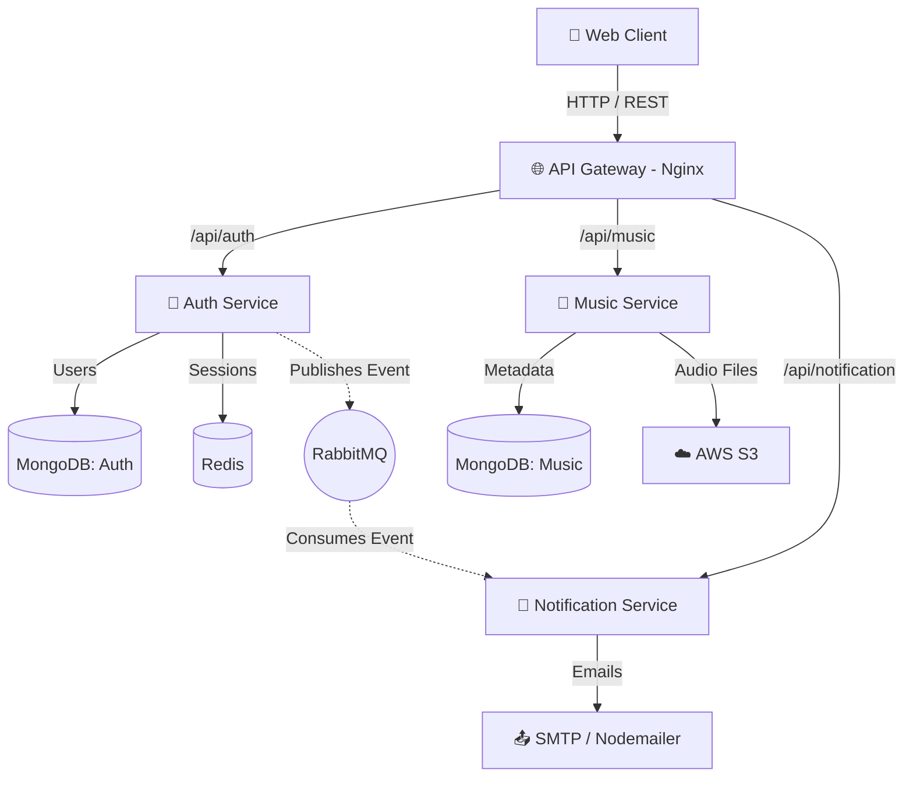

<div align="center">
  
  <h1>🎵 Aura Music Player</h1>
  
  <!-- Animated Typing Text -->
  <a href="https://aura-frontend-omq4.onrender.com">
    
  </a>

  <br />

  <!-- Live Demo Button -->
  <a href="https://aura-frontend-omq4.onrender.com">
    
  </a>

  <br /><br />

  <!-- Badges -->
  <p>
    <a href="https://react.dev/"></a>
    <a href="https://nodejs.org/"></a>
    <a href="https://www.rabbitmq.com/"></a>
    <a href="https://www.docker.com/"></a>
    <a href="https://kubernetes.io/"></a>
    <a href="https://tailwindcss.com/"></a>
  </p>
</div>

---

## 📖 Table of Contents
1. [🌟 System Design Overview](#-system-design-overview)
2. [🏗️ Architecture Breakdown](#-architecture-breakdown)
3. [✨ Features & Benefits](#-features--benefits)
4. [📸 UI & Feature Experience](#-ui--feature-experience)
5. [⚙️ Tech Stack & Tools](#️-tech-stack--tools)
6. [📂 Folder Structure](#-folder-structure)
7. [🔐 Security & Authentication](#-security--authentication)
8. [📡 Core API Documentation](#-core-api-documentation)
9. [🚀 Setup & Installation Guide](#-setup--installation-guide)
10. [☸️ Kubernetes & DevOps](#️-kubernetes--devops)
11. [📊 Performance & Scalability](#-performance--scalability)
12. [🔥 Future Improvements](#-future-improvements)

---

## 🌟 System Design Overview

**Aura Music Player** is engineered to production standards using a modern **Microservices Architecture**. By separating concerns into highly cohesive boundary contexts (Auth, Music, Notification), the application achieves fault isolation, independent deployments, and horizontal scalability. 

Standardized communication is enforced via RESTful APIs mapped through an **Nginx API Gateway**, while asynchronous background tasks and events are reliably distributed using **RabbitMQ**.

> **💡 Why this project stands out:** It bridges the gap between a standard CRUD application and a scalable enterprise solution by implementing distributed messaging, robust in-memory caching (Redis), secure stateless authentication, and Kubernetes-ready containerization.

---

## 🏗️ Architecture Breakdown

### Logical System Architecture
The application is structured across four core isolated layers:
1. **Frontend Layer:** React SPA utilizing Vite for fast builds and Zustand for lean state management.
2. **API Gateway:** Nginx reverse proxy routing traffic (`/api/auth`, `/api/music`, `/api/notification`) to their respective underlying microservices.
3. **Application Services:** 
   - 🔐 `auth-service`: Manages user identities, stateless JWT sessions, OAuth2 flows, and emits user lifecycle events.
   - 🎵 `music-service`: Handles tracks, libraries, playlists, and secure AWS S3 integrations for MP3 storage.
   - 📧 `notification-service`: Consumes RMQ events to reliably orchestrate transactional emails (e.g., Welcome Emails, Password Resets).
4. **Data & Messaging Layer:** MongoDB (Persistence), Redis (Caching/Sessions), RabbitMQ (Message Broker).

### Visual Layout


### Request Lifecycle Example (Registration Flow)
1. **Client** POSTs registration details to `/api/auth/register`.
2. **API Gateway** intercepts and proxies the request to the **Auth Service**.
3. **Auth Service** validates the payload, hashes the password via `bcrypt`, saves the record to **MongoDB**, and generates a secure JWT.
4. **Auth Service** publishes a `USER.REGISTERED` event to **RabbitMQ**.
5. **Notification Service** asynchronously pulls the event from the queue and sends a Welcome Email via **Nodemailer**.
6. **Client** instantly receives a `201 Created` response without waiting for the email transmission to complete.

---

## ✨ Features & Benefits

- **🛡️ Role-Based Access Control (RBAC):** Distinct `Listener` and `Artist` boundaries. Only authenticated artists can upload heavy media content to AWS S3.
- **⚡ Asynchronous Workflows:** Heavy networking tasks like email transmission are offloaded to background queues, keeping the main thread clear and API response times under 100ms.
- **🔐 Resilient Authentication:** A seamless mix of HttpOnly JWT cookies and Google OAuth2, augmented by Redis for lightning-fast token validation and session invalidation.
- **🎨 Highly Responsive UI:** Driven by modern tooling (`Tailwind CSS v4`, `Framer Motion`), providing hardware-accelerated smooth transitions and flexible mobile-first layouts.

---

## 📸 UI & Feature Experience

### 1. Landing & Authentication
*Secure, fast onboarding with standard credentials or Google OAuth.*
 
* **User Flow:** Guest visits Landing -> Google Auth or standard login -> Redirected to User Dashboard.
* **Benefits:** Frictionless onboarding keeps conversion rates high.

### 2. General Dashboard & Library
*Browse, search, and manage localized user playlists seamlessly.*

* **User Flow:** Fetch personalized feed -> Like tracks -> System dynamically builds user's `/playlist`.
* **APIs Connected:** `GET /api/music/get`, `GET /api/music/playlist/get`

### 3. Artist Upload Portal
*Secure uploads directly linking track metadata to cloud blob storage.*

* **User Flow:** Artist logs in -> Uploads MP3 & Cover Photo -> Multer buffer streams securely to AWS S3 bucket.
* **Tech:** `multer`, `@aws-sdk/client-s3`.

> 🎬 **Demo Preview:**  
> *Check out our application flow in the `docs/` folder!*

---

## ⚙️ Tech Stack & Tools

| Component | Technologies Chosen | Rationale |
|-----------|--------------------|-----------|
| **Frontend** | React 19, Vite, Tailwind CSS v4, Zustand | React for component-driven UI; Zustand for zero-boilerplate global state; Vite for instant HMR. |
| **Backend** | Node.js, Express.js | Event-driven JavaScript fits perfectly with our asynchronous architectural goals. |
| **Databases** | MongoDB, Mongoose | Schema flexibility across microservices natively handling JSON document structures. |
| **Caching** | Redis (ioredis) | Millisecond latency for authentication checks and transient session storage. |
| **Messaging** | RabbitMQ (amqplib) | Industry-standard AMQP protocol guarantees resilient message delivery to queues. |
| **Cloud/File**| AWS S3 | Infinite, highly-available BLOB storage for heavy `.mp3` media and image assets. |
| **DevOps** | Docker, K8s (Minikube), Nginx | Solves "It works on my machine". Nginx elegantly handles reverse proxying and API routing. |

---

## 📂 Folder Structure
```bash
aura-music-player/
├── 📁 Frontend
│   ├── 📁 public
│   ├── 📁 src
│   │   ├── 📁 api
│   │   ├── 📁 components
│   │   ├── 📁 context
│   │   ├── 📁 pages
│   │   ├── 📁 store
│   │   ├── 📄 App.jsx
│   │   └── 🎨 index.css
│   ├── 🐳 Dockerfile
│   └── ⚙️ package.json
├── 📁 api-gateway
│   ├── 🐳 Dockerfile
│   └── ⚙️ nginx.conf
├── 📁 auth
│   ├── 📁 src
│   │   ├── 📁 broker
│   │   ├── 📁 controllers
│   │   ├── 📁 middlewares
│   │   └── 📄 app.js
│   ├── 🐳 Dockerfile
│   └── ⚙️ package.json
├── 📁 k8s
│   ├── ⚙️ api-gateway.yaml
│   ├── ⚙️ auth.yaml
│   ├── ⚙️ frontend.yaml
│   ├── ⚙️ music.yaml
│   └── ⚙️ redis.yaml
├── 📁 music
│   ├── 📁 src
│   │   ├── 📁 broker
│   │   ├── 📁 services
│   │   └── 📄 app.js
│   ├── 🐳 Dockerfile
│   └── ⚙️ package.json
└── 📁 notification
    ├── 📁 src
    │   ├── 📁 broker
    │   ├── 📁 utils
    │   └── 📄 app.js
    ├── 🐳 Dockerfile
    └── ⚙️ package.json
```

---

## 🔐 Security & Authentication

1. **Tokens & Sessions:** Employs stateless `JWT` (JSON Web Tokens) securely delivered via `HttpOnly`, `Secure` Cookies.
2. **Header Protection:** Empowered by `helmet` to mitigate common web vulnerabilities like XSS, Clickjacking, and MIME sniffing.
3. **Password Security:** Credentials are salted and heavily hashed using `bcrypt` before database persistence.
4. **Endpoint Guarding:** Custom `authMiddleware` and `authArtistMiddleware` enforce strict Authorization verifications before controller execution.

---

## 📡 Core API Documentation

### Auth Service (`/api/auth`)
| Method | Endpoint | Purpose | Protection Level |
|--------|---------|---------|------------------|
| `POST` | `/register` | Register new user account | Public 🌍 |
| `POST` | `/login` | Authenticate and issue JWT | Public 🌍 |
| `GET` | `/me` | Retrieve user profile metadata | Secured 🔒 |

### Music Service (`/api/music`)
| Method | Endpoint | Purpose | Protection Level |
|--------|---------|---------|------------------|
| `GET` | `/get` | Retrieve global music tracks | Public 🌍 |
| `POST` | `/create` | Upload new mp3 & cover (`multipart/form-data`) | Artist Only 🎸 |
| `POST` | `/playlist/create` | Save track collection | Secured 🔒 |

---

## 🚀 Setup & Installation Guide

### Prerequisites
- Node.js `v18+`
- Docker & Docker Compose
- AWS Account (Access Keys for S3 bucket)

### Local Development (Docker Compose) - *Recommended*
1. **Clone the repository:**
   ```bash
   git clone https://github.com/DevanshuTiwaskar/Micro-service-Project.git
   cd Micro-service-Project
   ```
2. **Environment Variables:**
   Create `.env` files in `auth/`, `music/`, and `notification/` configuring your DB, AWS, and Email credentials.

3. **Spin up the stack:**
   ```bash
   docker-compose up --build -d
   ```
4. **Access the application:**
   - Web App: `http://localhost:5173`
   - RabbitMQ Management: `http://localhost:15672`
   - API Gateway: `http://localhost:80`

---

## ☸️ Kubernetes & DevOps

Aura Music is fully configured for a local `Minikube` K8s cluster, paving the way for seamless transitions to AWS EKS or GCP GKE production deployments.

- **Deployments:** Ensure zero-downtime rollouts. Each microservice scales independently via its ReplicaSet.
- **Networking:** Internal `ClusterIP` networks strictly isolate databases (Mongo, Redis) from public access.
- **Ingress:** Bound by a `NodePort` or `LoadBalancer` via Nginx, routing inbound traffic cleanly to services.

**Running K8s Locally:**
```bash
minikube start
eval $(minikube docker-env)

# Build local K8s-ready images
docker build -t frontend:latest ./Frontend
docker build -t auth-service:latest ./auth
docker build -t music-service:latest ./music
docker build -t notification-service:latest ./notification
docker build -t api-gateway:latest ./api-gateway

# Apply configurations
kubectl apply -f k8s/
kubectl get pods -w
```

---

## 📊 Performance & Scalability
- **Horizontal Scaling:** Because connection states (like JWTs) are externalized to Redis or kept client-side, we can horizontally scale `music` or `auth` pods on demand without encountering sticky-session issues.
- **Offloading Work:** Time-intensive external integrations (AWS S3 byte streaming, SMTP email transmission) do not block the Node.js Main Event Loop, maintaining ultra-fast API throughput.

---

## 🔥 Future Improvements
- [ ] **CI/CD Pipeline:** Implement GitHub Actions to automate linting, K8s manifest validation, and DockerHub image pushes.
- [ ] **Observability:** Integrate **Grafana & Prometheus** for centralized tracing, crash reporting, and K8s internal metrics.
- [ ] **Rate Limiting:** Protect APIs against brute-force abuse using `express-rate-limit` inside the Gateway layer.
- [ ] **ElasticSearch Integration:** Upgrade the standard MongoDB search to a high-speed fuzzy query engine for instantaneous track lookup.

---

<div align="center">
  <i>Built with ❤️ focusing on exceptional engineering.</i>
</div>