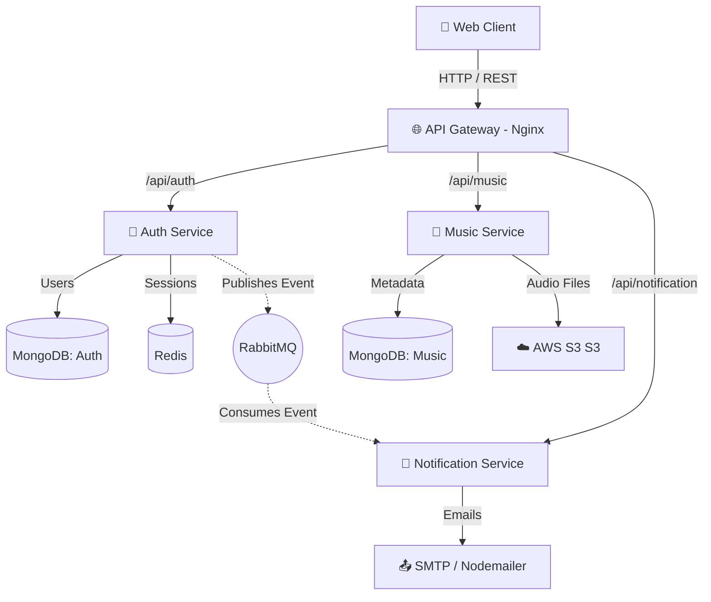

<div align="center">
  
  <h1>🎵 Aura Music Player</h1>
  <p><em>A highly scalable, event-driven Microservices Music Player Web Application.</em></p>

  [](https://reactjs.org/)
  [](https://nodejs.org/)
  [](https://www.rabbitmq.com/)
  [](https://www.docker.com/)
  [](https://kubernetes.io/)
</div>

---

## 📖 Table of Contents
1. [🌟 System Design Overview](#-system-design-overview)
2. [🏗️ Architecture Breakdown](#-architecture-breakdown)
3. [✨ Features & Benefits](#-features--benefits)
4. [📸 UI & Feature Experience](#-ui--feature-experience)
5. [⚙️ Tech Stack & Tools](#️-tech-stack--tools)
6. [📂 Folder Structure](#-folder-structure)
7. [🔐 Security & Authentication](#-security--authentication)
8. [📡 Core API Documentation](#-core-api-documentation)
9. [🚀 Setup & Installation Guide](#-setup--installation-guide)
10. [☸️ Kubernetes & DevOps](#️-kubernetes--devops)
11. [📊 Performance & Scalability](#-performance--scalability)
12. [🧪 Testing Strategy](#-testing-strategy)
13. [🔥 Future Improvements](#-future-improvements)

---

## 🌟 System Design Overview
Aura Music Player is engineered to production standards using a **Microservices Architecture**. By separating concerns into highly cohesive boundary contexts (Auth, Music, Notification), the application achieves fault isolation, decoupled deployments, and horizontal scalability. Standardized communication is enforced via RESTful APIs mapped through an **Nginx API Gateway**, while asynchronous events are reliably distributed using **RabbitMQ**.

> **💡 Why this project stands out:** It bridges the gap between a standard CRUD app and a scalable enterprise solution by implementing distributed messaging, robust in-memory caching (Redis), secure stateless authentication, and Kubernetes-ready containerization.

---

## 🏗️ Architecture Breakdown

### Logical System Architecture
The application runs across four core isolated layers:
1. **Frontend Layer:** React SPA with Vite and Zustand for state management.
2. **API Gateway:** Nginx reverse proxy routing `/api/auth`, `/api/music`, and `/api/notification` to their respective microservices.
3. **Application Services:** 
   - `auth-service`: Manages users, JWTs, OAuth2, and emits user lifecycle events.
   - `music-service`: Handles tracks, libraries, AWS S3 MP3 storage integrations.
   - `notification-service`: Consumes RMQ events to orchestrate transactional emails.
4. **Data & Messaging Layer:** MongoDB (Persistence), Redis (Caching/Sessions), RabbitMQ (Message Broker).

### Visual Layout


### Request Lifecycle Example (Registration Flow)
1. **Client** POSTs to `/api/auth/register`.
2. **API Gateway** proxies request to the **Auth Service**.
3. **Auth Service** validates request, hashes password, saves to **MongoDB**, and generates JWT.
4. **Auth Service** publishes `AUTHENTICATION_NOTIFICATION_USER.REGISTERED` to **RabbitMQ**.
5. **Notification Service** asynchronously pulls the event from the RMQ queue and sends a Welcome Email via **Nodemailer**.
6. Client instantly receives a `201 Created` response without waiting for the email to send.

---

## ✨ Features & Benefits
- **Role-Based Access Control (RBAC):** Distinct `Listener` and `Artist` boundaries. Only artists can push content to AWS S3.
- **Asynchronous Workflows:** Heavy networking tasks like email are offloaded to background queues, keeping UI response times under <100ms.
- **Resilient Authentication:** Seamless mix of standard JWT and Google OAuth2, augmented by Redis for lightning-fast token validation.
- **Highly Responsive UI:** Driven by modern tooling (`Framer Motion`, `Tailwind CSS V4`), providing smooth transitions and mobile-first responsibilities.

---

## 📸 UI & Feature Experience

### 1. Landing & Authentication
*Secure onboarding with JWT & Google OAuth.*
 
* **User Flow:** Guest visits Landing -> Google Auth or standard login -> Redirected to User Dashboard.
* **Benefits:** Frictionless onboarding keeps conversion rates high.

### 2. General Dashboard & Library
*Browse, search, and manage localized user playlists.*

* **User Flow:** Fetch personalized feed -> Like tracks -> System builds dynamic `/playlist`.
* **APIs Connected:** `GET /api/music/get`, `GET /api/music/playlist/get`

### 3. Artist Upload Portal
*Secure uploads directly linking metadata to cloud blob storage.*

* **User Flow:** Artist logs in -> Uploads MP3 & Cover Photo -> Multer buffer streams securely to AWS S3.
* **Tech:** `multer`, `@aws-sdk/client-s3`.

> 🎬 **Quick Demo (GIF Prototype):**
> *Imagine a 10s GIF here showing: Login -> Browsing music -> Skipping track -> Quick Playlist Add.*
> *[Place `demo.gif` in `/docs` directory]*

---

## ⚙️ Tech Stack & Tools

| Category | Technologies Chosen | Why we chose it? |
|----------|--------------------|------------------|
| **Frontend** | React 19, Vite, Tailwind 4, Zustand | React for component-driven UI; Zustand for zero-boilerplate global state; Vite for instant HMR. |
| **Backend** | Node.js, Express.js | Event-driven JavaScript fits perfectly with our async architecture. |
| **Databases** | MongoDB, Mongoose | Schema flexibility across microservices natively handling JSON document structures. |
| **Caching** | Redis (ioredis) | Millisecond latency for authentication checks and transient token storage. |
| **Messaging** | RabbitMQ (amqplib) | Industry standard AMQP protocol guarantees message delivery to Notification queues. |
| **Cloud/File**| AWS S3 | Infinite, highly-available BLOB storage for heavy `.mp3` media. |
| **DevOps** | Docker, Docker Compose, K8s (Minikube), Nginx | Solves "It works on my machine". Nginx handles reverse proxying correctly resolving CORS. |

---

## 📂 Folder Structure
```bash
aura-music-player/
├── Frontend/               # React SPA Web Client
│   ├── src/pages/          # React Views (Library, Dashboard, etc.)
│   └── package.json        
├── api-gateway/            # Nginx Reverse Proxy
│   ├── nginx.conf          # Routing Rules
│   └── Dockerfile          
├── auth/                   # Identity & Auth Microservice
│   ├── src/routers/        # Express Routes (/login, /register)
│   └── package.json        
├── music/                  # Catalog & Streaming Microservice
│   ├── src/router/         # S3 Uploads & Playlist management
│   └── package.json        
├── notification/           # Background Email Microservice
│   ├── src/routers/        # Inter-service RMQ integrations
│   └── package.json        
├── k8s/                    # Kubernetes Deployments & Services
│   ├── api-gateway.yaml    
│   ├── auth.yaml           
│   └── ...                 
└── docker-compose.yml      # Local dev orchestration
```

---

## 🔐 Security & Authentication

1. **Tokens & Sessions:** Employs stateless `JWT` stored inside HttpOnly Cookies.
2. **Header Protection:** Bound by `helmet` to mitigate XSS and Clickjacking.
3. **Password Security:** Salted and hashed heavily via `bcrypt`.
4. **Endpoint Guarding:** Extracted custom `authMiddleware` and `authArtistMiddleware` for robust Authorization verifications before execution.

---

## 📡 Core API Documentation

### Auth Service
| Method | Endpoint | Purpose | Protection Level |
|--------|---------|---------|------------------|
| `POST` | `/api/auth/register` | Register new user | Public |
| `POST` | `/api/auth/login` | Authenticate and issue JWT | Public |
| `GET` | `/api/auth/me` | Retrieve profile metadata | Secured 🔒 |

### Music Service
| Method | Endpoint | Purpose | Protection Level |
|--------|---------|---------|------------------|
| `GET` | `/api/music/get` | Retrieve global tracks | Public |
| `POST` | `/api/music/create` | Upload new mp3 & cover (`multipart/form-data`) | Artist Only 🎸 |
| `POST` | `/api/music/playlist/create` | Save track collection | Secured 🔒 |

> **Response Example (`GET /api/music/health`):**
```json
{
  "status": "OK",
  "service": "music",
  "timestamp": "2026-03-20T10:30:00Z"
}
```

---

## 🚀 Setup & Installation Guide

### Prerequisites
- Node.js `v18+`
- Docker Desktop
- RabbitMQ & Redis (or let Docker Compose handle them)
- AWS Account (for S3 bucket keys)

### 1. Local Development (Docker Compose) - *Recommended*
1. Clone the repository.
2. Add `.env` inside `auth/`, `music/`, and `notification/` (Use `EMAIL_USER` & generic configs).
3. Run the orchestration command:
```bash
docker-compose up --build -d
```
4. Access the web app at **`http://localhost:5173`** and RabbitMQ management at **`http://localhost:15672`**.

---

## ☸️ Kubernetes & DevOps
Aura Music is fully configured for a local `Minikube` cluster, paving the way for AWS EKS or GCP GKE production deployments.

- **Deployments:** Ensure Zero-Downtime rollouts. Each microservice scales independently via its ReplicaSet.
- **Services:** Internal `ClusterIP` networks strictly isolate database access (Mongo, Redis) away from the public eye.
- **Ingress/API Gateway:** Bound by a `NodePort` or `LoadBalancer` (via Nginx) directing inbound traffic safely.

**Run in K8s:**
```bash
minikube start
eval $(minikube docker-env)
# Build local images
docker build -t frontend:latest ./Frontend
kubectl apply -f k8s/
kubectl get pods -w
```

---

## 📊 Performance & Scalability
- **Horizontal Scaling:** Because states (like JWTs) are externalized to Redis or kept inside the token payload, we can safely clone `music` or `auth` pods unconditionally.
- **Offloading Work:** Time-intensive integrations (AWS S3 chunk streams, SMTP email transmission) do not lock the Node.js Main Thread.

---

## 🧪 Testing Strategy
- **Unit Testing:** Recommended to leverage `Jest` for individual controller mock verifications.
- **Integration Testing:** Uses Postman collections covering cross-service logic (e.g. User registers -> Verify RabbitMQ queue captures payload).
- **Chaos Testing:** Manually killing the Redis container confirms the Auth fallback behaviors logic.

---

## 🔥 Future Improvements
- [ ] **CI/CD Pipeline:** GitHub actions to automatically run linting and push Docker images to DockerHub.
- [ ] **Grafana / Prometheus:** Centralized tracing and internal metrics.
- [ ] **Rate Limiting:** Protect APIs against abuse using `express-rate-limit` inside API Gateway.
- [ ] **ElasticSearch Integration:** Upgrading our standard MongoDB Music search to a high-speed fuzzy query engine.

---

### 💼 Open Source / Contributions
Have an idea? We welcome Pull Requests! Create a fork, commit your feature, and submit a PR for review.

> *Built with ❤️ focusing on exceptional engineering.*